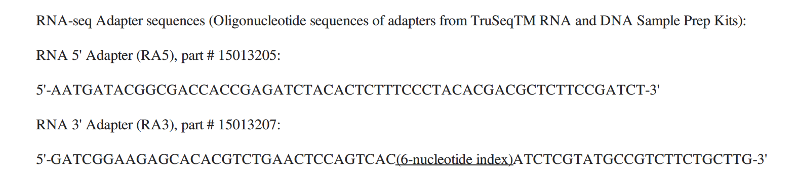

# Data preprocessing pipeline used for preparing the inputs of MERLIN-P-TFA in the GRAsp paper 
If you're a Roy Lab member, this GitHub repo is a mirror of the following folder:
```
/mnt/dv/wid/projects7/Roy-Aspergillus/merlin-preprocess/
```
The following instructions are compatible with Linux. We used CentOS Linux version 7. 

## Step 1: Download Raw Reads (.fastq.gz files)
For each dataset, identify its BioProject ID, e.g., for dataset GSE30579, the BioProject ID is PRJNA144647 as mentioned in Section "Relations" on its GEO page (https://www.ncbi.nlm.nih.gov/geo/query/acc.cgi?acc=GSE100101). Then go to SRA Explorer (https://sra-explorer.info/) and paste the BioProject ID. It will display all samples associated with the dataset. Select all the samples and add them to "collection".
**Warning:** Make sure the collection is empty before adding anything to collection. Sometimes SRA Explorer remembers your older sessions. To avoid that, refresh your browser before adding samples to the collection.

Once all the samples are added, a blue button with a shopping cart icon will show up at the top right corner. It will say something like "6 saved datasets" where 6 is the number of samples you have added to the collection (please don't get confused with the term "dataset"). Click on that button. It will open up a panel called "FastQ Downloads". The panel will have multiple collapsible sub-panels. Click on sub-panel "Bash script for downloading FastQ files". Copy the script and save it in a .sh file, say "fastq_downloader_SraExplorer.sh". Make it executable with "chmod +x fastq_downloader_SraExplorer.sh". Then run it with "bash fastq_downloader_SraExplorer.sh".

Once the raw reads are downloaded, separate the non-Aspergillus fumigatus samples from the Aspergillus ones. Only use the Aspergillus samples for further processing. Rename the .fastq.gz files if necessary. The SRA Explorer renames them unnecessarily. For single-end reads, simply rename them to their SRR ID, e.g., "SRR309223.fastq.gz". For paired-end reads, suffix them with 1 and 2, e.g., "SRR309220_1.fastq.gz" and "SRR309220_2.fastq.gz".

Download all sample accession IDs (e.g., SRR IDs) of Aspergillus fumigatus related to a dataset (say, GSE30579) and save inside a text file.
E.g., /mnt/dv/wid/projects7/Roy-Aspergillus/Data/RnaSeq/Ref_02/RoylabRsemProcessed/GSE30579/SRR_Acc_List_GSE30579.txt
One easy way to get the sample IDs is as follows:
Go to SRA Run Selector https://www.ncbi.nlm.nih.gov/Traces/study/?
* Enter the BioProject ID of the dataset (which is PRJNA144647 for dataset GSE30579)
* Under Section "Select", click on the "Accession List" button
* It will download a text file with all sample IDs
* remove non-Aspergillus fumigatus sample Ids
* rename the text file to "SRR_Acc_List_GSE30579.txt".

If there are single-end samples, create another text file named "SRR_Acc_List_GSE30579_SE.txt" containing only the single-end sample IDs.
If there are paired-end samples, create another text file named "SRR_Acc_List_GSE30579_PE.txt" containing only the paired-end sample IDs.

For example, GSE30579 has total 4 samples: 2 single-end and 2 paired-end. Therefore, there are three text files.
SRR_Acc_List_GSE30579.txt: contains all 4 sample IDs.
SRR_Acc_List_GSE30579_SE.txt: contains 2 sample IDs that are single-ended.
SRR_Acc_List_GSE30579_PE.txt: contains 2 sample IDs that are paired-ended.
These text files will be indispensable while running scripts in the future steps.

---
## Step 2: Clip Adapter Sequences with Trimmomatic
Apply Trimmomatic on the raw reads to trim adapter sequences.

For single-end reads, use the following command:
```
## Trimmomatic reads the raw reads from ${RAW_READ_DIR} and outputs to ${TRIMMED_READ_DIR}).
## TRIMMOMATIC_DIR="programs/Trimmomatic-0.39/Trimmomatic-0.39"
java -jar ${TRIMMOMATIC_DIR}/trimmomatic-0.39.jar SE -trimlog ${TRIMMED_READ_DIR}/${SRR_ID}_trimlog.txt ${RAW_READ_DIR}/${SRR_ID}.fastq.gz ${TRIMMED_READ_DIR}/${SRR_ID}.fq.gz ILLUMINACLIP:${TRIMMOMATIC_DIR}/adapters/.fa:2:30:10:2:keepBothReads LEADING:5 TRAILING:5 MINLEN:36
```

For paired-end reads, use the following command:
```
java -jar ${TRIMMOMATIC_DIR}/trimmomatic-0.39.jar PE -trimlog ${TRIMMED_READ_DIR}/${SRR_ID}_trimlog.txt ${RAW_READ_DIR}/${SRR_ID}_1.fastq.gz ${RAW_READ_DIR}/${SRR_ID}_2.fastq.gz ${TRIMMED_READ_DIR}/${SRR_ID}_forward_paired.fq.gz ${TRIMMED_READ_DIR}/${SRR_ID}_forward_unpaired.fq.gz ${TRIMMED_READ_DIR}/${SRR_ID}_reverse_paired.fq.gz ${TRIMMED_READ_DIR}/${SRR_ID}_reverse_unpaired.fq.gz ILLUMINACLIP:${TRIMMOMATIC_DIR}/adapters/.fa:2:30:10:2:keepBothReads LEADING:5 TRAILING:5 MINLEN:36
```

Selecting the appropriate adapter file is critical. Please read Section "The Adapter Fasta" in the Trimmomatic manual to get a general guideline (programs/Trimmomatic-0.39/TrimmomaticManual_V0.32.pdf). Subsequently, read Section "Materials and Methods" of the reference paper for the concerned dataset to check whether there are any deviations from the general guideline. Please also read the discussion at https://www.biostars.org/p/323087/ to understand how other researcher select adapter files.

**Q. Which adapter FASTA file to use with the in-house dataset GSE231238 (a.k.a. Ref_39)?**  
**A.** The RNA sequencing for this dataset had been performed by a company named Novogene.
However, when we asked Novogene which adapter version had been used, they remarked that they do not possess that record anymore. Fortunately,
we were able to find out the exact adapter sequences Novogene used from the Novogene delivery documents. By comparing these sequences with
that of different adapter files, "TruSeq2-PE.fa" is found to be the best match. It has a perfect match for the 5' adapter and an exact reverse
complement for the 3' adapter. The reverse complement part remains the sole source of confusion. However, we decided to go ahead with
"TruSeq2-PE.fa" for these data sets.
The Novogene adapter sequences are shown in the figure below.


Different versions of adapter files are retrieved from https://github.com/usadellab/Trimmomatic/tree/main/adapters.

---
## Step 3: Generate Quality Control (QC) Reports with FastQC-MultiQC
For each dataset, generate FastQC reports using the following command:
```
## Use 8 parallel threads
/mnt/dv/wid/projects7/Roy-Aspergillus/Programs/FastQC/fastqc -t 8 <input_dir>/*.fastq.gz -o <output_dir>/
```

Combine all the FastQC reports corresponding to the given dataset into a single MultiQC report, we need the "multiqc" command.
To install the multiqc command, please create a conda environment -> install multiqc -> activate the environment.
module load anaconda3-2020.02
conda create --name multiqc python=3.7.6
conda install -c bioconda -c conda-forge multiqc
conda activate multiqc

Once the multiqc command is installed, run it as follows:
multiqc -o <output_dir>/ <input_dir>/

For each dataset, generate one MultiQC report before trimming (i.e. with raw reads/.fastq.gz files) and one MultiQC report after trimming (i.e. with trimmed reads/.fq.gz files). Analyze whether the trimming was effective by comparing the two reports. Please see https://elog.discovery.wisc.edu/Software/165 to learn how to interpret a MultiQC report.

---
To reproduce the results of TGS-T and TGS-T+ given in the paper, you need to follow the steps mentioned below. 
* **Step 1:** Install R version 3.5.1 in your experimental environment ([here](https://github.com/sap01/TGS-T-supplem/blob/master/README.md#installing-r-version-351-in-the-experimental-environment))
* **Step 2:** Execute the TGS-T and TGS-T+ algorithms ([here](https://github.com/sap01/TGS-T-supplem/blob/master/README.md#executing-the-tgs-lite-and-tgs-lite-algorithms-in-the-experimental-environment)).

## Installing R version 3.5.1 in the Experimental Environment
In this section, the following sub-steps are described:
* Installing or compiling R ([here](https://github.com/sap01/TGS-T-supplem/blob/master/README.md#installing-or-compiling-r))
* Installing the ‘packrat’ dependency management package for R ([here](https://github.com/sap01/TGS-T-supplem/blob/master/README.md#installing-the-packrat-dependency-management-package-for-r))

### Installing or Compiling R
The experimental environment uses R version 3.5.1 (hereafter, R-3.5.1). Therefore, it is expected that any R version, same or higher than that, should suffice. For R-3.5.1 installation in Windows or macOS, please consult the following official manuals, respectively.
* 'Installing R under Windows': https://cran.r-project.org/doc/manuals/r-release/R-admin.html#Installing-R-under-Windows
  * Download R version 3.5.1 for Windows: https://cran.r-project.org/bin/windows/base/old/3.5.1
* 'Installing R under macOS': https://cran.r-project.org/doc/manuals/r-release/R-admin.html#Installing-R-under-macOS

For Unix and Unix-alike OSs (like - Linux OSs), R-3.5.1 can be compiled to a destination directory of your choice from the R-3.5.1 source tarball ( https://github.com/sap01/TGS-T-supplem/blob/master/Sourcecode/R-3.5.1.tar.gz ). Compilation is different from a system-wide installation. A R compilation inside a specific directory does not affect the system-wide installation or any other compilation inside any other directory. Thus, you may create multiple compilations in your system, where each compilation refers to a distinct version of R.

Please keep the source tarball and the ‘compileR351.sh’ shell script ( https://github.com/sap01/TGS-T-supplem/blob/master/Sourcecode/compileR351.sh ) inside the same directory. Then open the shell script and replace the value of the variable ‘COMPILEPATH’ to a directory of your choice, where you wish to have the compiled R-3.5.1. For example:
```
COMPILEPATH=/home/saptarshi/R/R-3.5.1
```
Kindly make sure that the given path exists. The script does not create the path itself. After the compilation path is assigned, execute the shell script as shown below: (here, the '$' symbol represents the bash command prompt)
```
$ ./compileR351.sh
```
The execution may take a few minutes to complete. What to do if the execution is successful and what to do if it fails, are described in the following two paragraphs, respectively.

**If ‘compileR351.sh’ Completes Execution Successfully:** If 'compileR351.sh' completes execution successfully, it builds a compiled version of R-3.5.1 inside the given directory. This specific compilation can now be invoked from bash using the following command: (basically, append ‘/bin/R’ to the compilation path)
```
$ /home/saptarshi/R/R-3.5.1/bin/R

R version 3.5.1 (2018-07-02) -- "Feather Spray"
Copyright (C) 2018 The R Foundation for Statistical Computing
...
>
```
Symbol '>' represents the R command prompt.

If the compilation path is very long, writing this command can be a tedious process. Instead, go to your home directory and append the following line to your '.bashrc' file: 
```
alias R351=/home/saptarshi/R/R-3.5.1/bin/R
```
Save and exit '.bashrc'. But the current bash session keeps using the older version of '.bashrc'. To mitigate this issue, source (reload) '.bashrc' as shown below:
```
$ source .bashrc
```
It creates an alias to the long command. Now, you may use the alias as follows:
```
$ R351

R version 3.5.1 (2018-07-02) -- "Feather Spray"
Copyright (C) 2018 The R Foundation for Statistical Computing
...
>
```

For executing any R script with R-3.5.1, please use the following command in bash:
```
$ /home/saptarshi/R-3.5.1/bin/Rscript path/to/script/script_to_run.R
```
**If ‘compileR531.sh’ Fails:** If 'compileR351.sh' fails (e.g. 'configure: error'), the reason behind the failure is that the OS does not have some of the required dependencies. Resolutions of a number of possible errors are discussed at: http://pj.freefaculty.org/blog/?p=315 ; if required, please find its offline PDF version at: https://github.com/sap01/TGS-T-supplem/blob/master/Sourcecode/building-r-devel-PJ.pdf . Source tarballs of most of the dependency packages are stored at: http://r.research.att.com/src/ . Also the ‘Installing R under Unix-alikes’ official manual can be consulted at: https://cran.r-project.org/doc/manuals/r-release/R-admin.html#Installing-R-under-Unix_002dalikes .

### Installing the 'packrat' Dependency Management Package for R
Once R is installed, the next step is to install the ‘packrat’ package (https://CRAN.R-project.org/package=packrat). It provides a dependency management system for the algorithmic implementations. In other words, it automatically downloads and installs the required packages with the required versions when the implementations of the TGS-T and TGS-T+ algorithms are being installed.
In the experimental environment, ‘packrat’ package version 0.5.0 is used. Therefore, it is expected that installing the same or a higher version would be sufficient.
In the experimental environment, a specific directory, namely 'src downloaded packages' is created to download required external packages, like - 'packrat'. Then the latest version of ‘packrat’ (version 0.5.0 at that time) is downloaded inside it and installed to the 'library' directory. This whole process is done through the following commands:

```
%% Go to the R compilation’s home directory
$ cd /home/saptarshi/R/R-3.5.1

%% Create a directory for downloading external R packages
$ mkdir src_downloaded_packages

%% Open an R session
$ R351
```
```r
## Download the latest version of the ’packrat’ package
## from ’https://cloud.r-project.org/’
## to ’/home/saptarshi/R/R-3.5.1/src_downloaded_packages’
## and install it inside ’/home/saptarshi/R/R-3.5.1/library’.
> install.packages(’packrat’, ’/home/saptarshi/R/R-3.5.1/library’,
dependencies = TRUE, repos = ’https://cloud.r-project.org/’,
destdir = ’/home/saptarshi/R/R-3.5.1/src_downloaded_packages’)
```
Finally, a directory with the name 'projects' is created where the algorithmic implementations would be installed.
```
$ mkdir /home/saptarshi/R/R-3.5.1/projects
```

## Executing the TGS-T and TGS-T+ Algorithms in the Experimental Environment
The R implementations of the TGS-T and TGS-T+ algorithms are saved as a R project tarball (https://github.com/sap01/TGS-T-supplem/blob/master/Sourcecode/TGS-T-2019-09-09.tar.gz). Copy this file to '/home/saptarshi/R/R-3.5.1/projects':
```
$ mv TGS-T-2019-09-09.tar.gz /home/saptarshi/R/R-3.5.1/projects
```
After that, unbundle the project using 'packrat':
```
%% Go to the project directory
$ cd /home/saptarshi/R/R-3.5.1/projects

%% Open an R prompt
$ R351
```
```r
## Set your favourite CRAN repo, e.g.,
## https://cran.rstudio.com/
> options(repos=structure(c(CRAN="https://cran.rstudio.com/")))

## Attach ’packrat’ package
> library(packrat)

## Unbundle the project inside the current directory
> packrat::unbundle(’TGS-T-2019-09-09.tar.gz’, getwd())
```
Once unbundled, a new project directory will be created with name 'TGS-T'. Go inside the project directory:
```
%% Go to /home/saptarshi/R/R-3.5.1/projects/TGS-T
$ cd TGS-T
```
Directory 'TGS-T' contains all required R scripts and two sub-directories: 'packrat' and 'asset'. The 'packrat' sub-directory is for internal management of 'packrat' and not to be interfered with. The 'asset' sub-directory is the place where the input and the output files are stored. Copy all the dataset files inside this sub-directory. For example, let us assume that the directory corresponding to https://github.com/aaiitg-grp/TGS/tree/master/datasets , in your local computer, is '/home/saptarshi/datasets'. Then copy all the files from that directory to 'TGS-T/asset':
```
$ scp /home/saptarshi/datasets/* asset
```
The driver R script is 'TGS-T/TGS.R'. It takes the user-defined input parameters in a JSON file format (http://www.json.org/). The JSON file must reside in the ‘asset’ sub-directory. ‘TGS.R’ can be executed with the following command:
```
%% Assuming that ’TGS-T/asset/input.json’ contains the user-defined parameters.
%% Note that only ’input.json’ is used instead of ’asset/input.json’. This
%% is because ’TGS.R’ is programmed to search for the input JSON files in
%% the ’asset’ sub-directory.
%% The ’&’ symbol instructs the execution process to start in the background.
$ nohup time /home/saptarshi/R/R-3.5.1/bin/Rscript TGS.R input.json &

%% Prints the process ID
[1] 8172
```
Since, the execution process is performed in the background, the bash command prompt can be used for other tasks. Once the execution is complete, a ‘Done’ message is automatically displayed in bash. However, if you wish to monitor the execution of the process, you may do so with the ‘top’ command as shown below:
```
%% Show details of the process with ID 8172
$ top -p 8172
```
